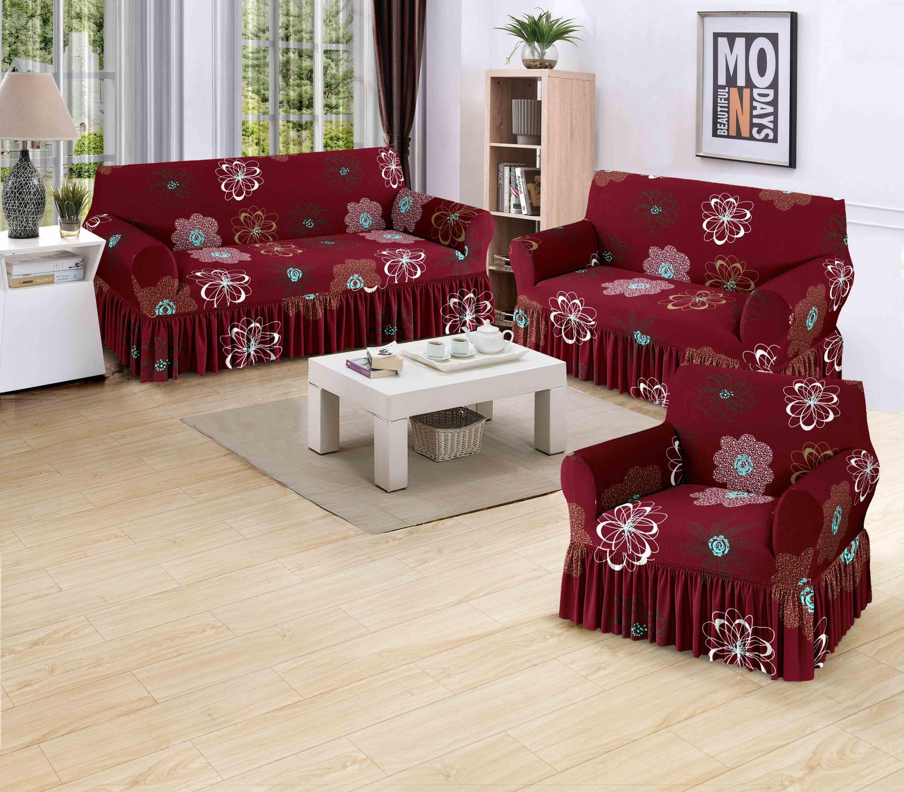

# 🏷️ Clases Especiales para Productos

En el archivo `index.html`, puedes agregar productos a las categorías especiales **"Novedades"** y **"Promociones"** simplemente añadiendo una clase CSS al elemento `<article>` del producto.

---

## 📌 Clases Disponibles

### 1. **Clase `novedad`** - Para nuevos productos
Agrega la clase `novedad` cuando el producto es nuevo en el catálogo.

**Efecto visual:**
- Badge azul/naranja con "⚡ NOVEDAD" 
- Borde naranja en la parte superior de la tarjeta
- Animación de pulso para llamar la atención

**Ejemplo:**
```html
<article class="card novedad" 
  data-nombre="Forro Sofá 311 Poliester Premium" 
  data-descripcion="..." 
  data-precio="$42.80" 
  data-images="img/forros/02/1.jpeg,...">
  
  <div class="card-info">
    <h3>Forro 311 Poliester Premium</h3>
    <button onclick="toggleProducto(this)">Consultar</button>
  </div>
</article>
```

---

### 2. **Clase `promocion`** - Para productos en oferta
Agrega la clase `promocion` para destacar productos con descuentos especiales.

**Efecto visual:**
- Badge rojo con "🎁 PROMOCIÓN"
- Borde rojo en la parte superior de la tarjeta
- Animación de pulso para llamar la atención

**Ejemplo:**
```html
<article class="card promocion" 
  data-nombre="Forro Sofá 321 Licra Estampado"
  data-descripcion="..."
  data-precio="$19.99"
  data-images="img/forros/23/1.jpeg,...">
  
  <div class="card-info">
    <h3>Forro 321 Licra Estampado</h3>
    <button onclick="toggleProducto(this)">Consultar</button>
  </div>
</article>
```

---

### 3. **Ambas clases** - Para ofertas especiales destacadas
Si quieres que un producto aparezca en AMBAS secciones (Novedades Y Promociones), solo agrega ambas clases.

**Efecto visual:**
- Badge dorado con "✨ OFERTA ESPECIAL"
- Borde con gradiente naranja-rojo
- Animación de pulso intensificada

**Ejemplo:**
```html
<article class="card novedad promocion" 
  data-nombre="Forro Sofá Premium Especial"
  data-descripcion="..."
  data-precio="$34.99"
  data-images="img/forros/special/1.jpeg,...">
  
  <div class="card-info">
    <h3>Forro Premium Especial</h3>
    <button onclick="toggleProducto(this)">Consultar</button>
  </div>
</article>
```

---

## 🎯 Cómo Usar

### Paso 1: Abre el archivo `index.html`

### Paso 2: Busca el producto que quieres destacar
Localiza el `<article class="card"...` del producto

### Paso 3: Agrega la clase
```html
<!-- Antes -->
<article class="card" data-nombre="...">

<!-- Después - Para Novedades -->
<article class="card novedad" data-nombre="...">

<!-- Después - Para Promociones -->
<article class="card promocion" data-nombre="...">

<!-- Después - Para ambas -->
<article class="card novedad promocion" data-nombre="...">
```

---

## 🔍 Para Ver los Productos Destacados

1. **Menú Hamburguesa** → Abre el menú en la esquina superior izquierda
2. **Accesos Rápidos** → Verás opciones para:
   - ⚡ **Novedades** - Muestra todos los productos con clase `novedad`
   - 🎁 **Promociones** - Muestra todos los productos con clase `promocion`
   - ⊞ **Ver Todo** - Muestra todas las categorías normales

---

## 💡 Consejos

- Los productos pueden tener ambas clases simultáneamente
- Los badges se ven automáticamente en las tarjetas
- Usa `novedad` para productos recién llegados al inventario
- Usa `promocion` para productos con precios especiales o descuentos
- Las clases no afectan al precio ni a la funcionalidad del producto
- Los productos destacados aparecen automáticamente en las secciones correspondientes

---

## ✅ Ejemplo Completo

```html
<!-- Producto como NOVEDAD -->
<article class="card novedad" 
  data-nombre="Almohada Memory Foam Premium" 
  data-descripcion="Almohada ergonómica con memory foam de alta densidad. Soporte cervical perfecto. Lavable a máquina. Garantía de 2 años." 
  data-precio="$45.50" 
  data-images="img/almohadas/04/1.jpeg,img/almohadas/04/2.jpeg">
  
  <div class="card-info">
    <h3>Almohada Memory Foam Premium</h3>
    <button onclick="toggleProducto(this)">Consultar</button>
  </div>
</article>

<!-- Producto como PROMOCIÓN -->
<article class="card promocion" 
  data-nombre="Sábana Algodón Puro 300 Hilos" 
  data-descripcion="Sábanas de algodón 100% puro. Suave al tacto. Resistente al lavado. Colores variados. Ahora con 30% descuento." 
  data-precio="$24.99" 
  data-images="img/sabanas/10/1.jpeg,img/sabanas/10/2.jpeg,img/sabanas/10/3.jpeg">
  
  <div class="card-info">
    <h3>Sábana Algodón Puro 300 Hilos</h3>
    <button onclick="toggleProducto(this)">Consultar</button>
  </div>
</article>
```

---

**¡Listo!** Ahora el menú hamburguesa mostrará automáticamente los productos destacados cuando hagas clic en "Novedades" o "Promociones". 🎉
